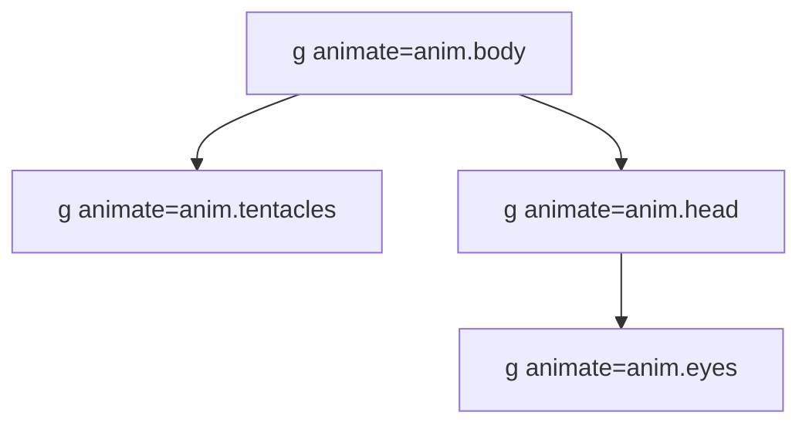

# Diretrizes de Conformidade do Mascote (OctoMascot)

Este documento estabelece as regras de design técnico e estrutural para o mascote Polvo da Octadesk, servindo de diretriz para qualquer agente ou desenvolvedor que realize modificações na interface.

---

## 1. Regra de Ouro: Sem Polvo Desconexo (Conectividade Estrutural)

O erro de separação física (cabeça flutuando longe dos tentáculos) ocorre quando o grupo da cabeça e o grupo dos tentáculos possuem animações de translação vertical (`y`) independentes ou dessincronizadas. 

### Diretrizes de Agrupamento SVG:
1. **Grupo Pai do Corpo (`body`)**: Todo movimento vertical principal (respiração, pulo de comemoração, tremores) deve ser aplicado no contêiner pai que encapsula **tanto a cabeça quanto os tentáculos**.
2. **Transform Origin**: O ponto de rotação e escala principal do corpo deve estar centrado no ponto médio de contato entre a cabeça e os tentáculos (coordenadas aproximadas `x: 50px, y: 70px`).
3. **Animações Locais Isoladas**:
   - A **Cabeça** só pode sofrer pequenas rotações locais ou sutis balanços horizontais. **Nunca** aplique translações `y` na cabeça de forma isolada sem compensação nos tentáculos.
   - Os **Tentáculos** só devem sofrer rotações (abrir/fechar) ou escalas locais a partir do seu ponto de fixação.

---

## 2. Padrões de Animação por Estado

| Estado | Animação do Corpo Pai (`body`) | Animação Local da Cabeça (`head`) | Animação Local dos Tentáculos (`tentacles`) |
| :--- | :--- | :--- | :--- |
| `idle` | Translação `y: [0, -3, 0]` suave (3s) | Sem translação vertical isolada. | Rotação sutil `rotate: [0, 3, -3, 0]` (2s) |
| `thinking` | Translação `y: [0, -2, 0]` rápida (1.2s) | Sem translação. Olhos piscam. | Escala suave `scale: [1, 1.04, 1]` (1s) |
| `trilha_*` | Pulo/Festa `y: [0, -10, 0]` (1.5s) | Pequena inclinação `rotate: [0, 4, -4, 0]`. | Rotação alegre `rotate: [0, 8, -8, 0]` |

---

## 3. Checklists de Homologação Visual
- [ ] A base inferior da cabeça intersecta a origem superior dos tentáculos em todos os quadros da animação.
- [ ] O headset move-se solidamente com a cabeça, sem atraso de renderização.
- [ ] Não há "gaps" brancos entre a cabeça e os tentáculos.
